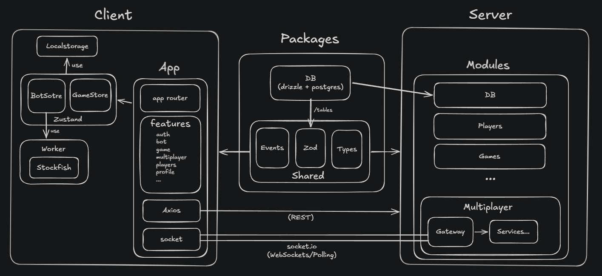

https://github.com/user-attachments/assets/10ec960d-5976-434f-a701-6237128302dc

# BChess

A multiplayer chess platform built with React and Node.js (Nest)

## Features
- **Profile** — Stats and games history.
- **Bot** — Play against bot with different difficulty levels (stockfish).
- **Multiplayer** — Play against other players in real-time.
- **Leaderboard** — Show top players with highest ratings.

## Architecture Overview



## Installation

### Prerequisites

- Node.js
- Docker
- pnpm

1. **Clone the repository**

```bash
git clone https://github.com/redarasmy/b-chess.git
cd b-chess
code .
```

2. **Install dependencies**

```bash
pnpm install
```

3. **Set environment variables**

```bash
cp .env.example .env
cp apps/server/.env.example apps/server/.env
cp apps/web/.env.example apps/web/.env
```

`.env` in `apps/server/` requires configuration for OAuth

4. **Run the database**

```bash
docker compose up -d
```

5. **Migrate DB Schemas**

```bash
pnpm db:migrate
```

6. **Run the app**

```bash
pnpm dev
```

The app will be available at `http://localhost:3000`.
